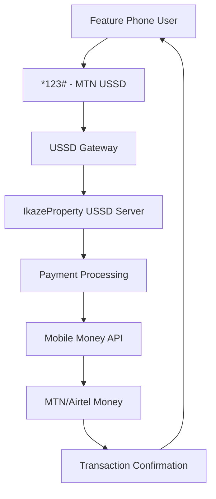

# USSD Payment Flow Documentation

## Overview

USSD (Unstructured Supplementary Service Data) payment integration for feature phone users in Rwanda. This enables users without smartphones or internet access to participate in the IkazeProperty marketplace.

## Architecture

### USSD Service Provider Integration



## USSD Menu Structure

### Main Menu
```
Welcome to IkazeProperty.rw
1. Browse Listings
2. My Account
3. Post Listing
4. Customer Support
5. Language/Ururimi
```

### Browse Listings Flow
```
1. Browse Listings
Select Category:
1. Houses/Amazu
2. Cars/Imodoka
3. Land/Butaka
4. Other/Bindi

Enter Location (District/Akarere):
[User Input]

Price Range:
1. < 100,000 RWF
2. 100,000 - 500,000 RWF
3. 500,000 - 1,000,000 RWF
4. > 1,000,000 RWF

Showing 5 results:
1. 3BR House Kicukiro - 450,000 RWF
2. 2BR Apartment Nyarugenge - 350,000 RWF
...
```

### Payment Flow
```
Selected: 3BR House Kicukiro - 450,000 RWF
1. Express Interest (5,000 RWF fee)
2. Contact Seller Directly
3. More Details

1. Express Interest
Payment Method:
1. MTN Mobile Money
2. Airtel Money

Enter MTN Number:
[User Input]

Enter PIN:
[Masked Input]

Confirm payment of 5,000 RWF for listing interest?
1. Confirm/Yego
2. Cancel/Guhora

Payment successful! Seller will contact you within 24hrs.
Transaction ID: TXN123456789
```

## Technical Implementation

### API Endpoints

#### USSD Gateway Endpoint
```
POST /api/ussd/gateway
Content-Type: application/json

{
  "sessionId": "session_123",
  "phoneNumber": "+250788123456",
  "ussdString": "1*2*3",
  "network": "MTN",
  "language": "rw"
}
```

#### Response Format
```json
{
  "response": "Welcome to IkazeProperty.rw\n1. Browse Listings\n2. My Account",
  "action": "REQUEST",
  "shouldClose": false
}
```

#### Payment Processing
```
POST /api/ussd/payment
Content-Type: application/json

{
  "sessionId": "session_123",
  "phoneNumber": "+250788123456",
  "amount": 5000,
  "listingId": "listing_456",
  "paymentMethod": "mtn"
}
```

### Database Schema

#### USSD Sessions Table
```sql
CREATE TABLE ussd_sessions (
  id VARCHAR(50) PRIMARY KEY,
  phone_number VARCHAR(20) NOT NULL,
  current_menu VARCHAR(50),
  session_data JSON,
  created_at TIMESTAMP DEFAULT CURRENT_TIMESTAMP,
  expires_at TIMESTAMP,
  is_active BOOLEAN DEFAULT TRUE
);
```

#### USSD Transactions Table
```sql
CREATE TABLE ussd_transactions (
  id VARCHAR(50) PRIMARY KEY,
  session_id VARCHAR(50),
  phone_number VARCHAR(20) NOT NULL,
  listing_id VARCHAR(50),
  amount DECIMAL(10,2) NOT NULL,
  payment_method VARCHAR(20),
  status ENUM('pending', 'completed', 'failed'),
  transaction_reference VARCHAR(100),
  created_at TIMESTAMP DEFAULT CURRENT_TIMESTAMP,
  completed_at TIMESTAMP NULL
);
```

## Mobile Money Integration

### MTN Mobile Money API
```javascript
// Payment initiation
const initiatePayment = async (phoneNumber, amount, reference) => {
  const response = await fetch('https://api.mtn.rw/v1/payments', {
    method: 'POST',
    headers: {
      'Authorization': `Bearer ${process.env.MTN_API_KEY}`,
      'Content-Type': 'application/json'
    },
    body: JSON.stringify({
      amount,
      currency: 'RWF',
      phoneNumber,
      reference,
      description: 'IkazeProperty listing interest'
    })
  })
  
  return response.json()
}
```

### Airtel Money API
```javascript
// Similar implementation for Airtel Money
const initiateAirtelPayment = async (phoneNumber, amount, reference) => {
  // Airtel Money API integration
}
```

## Security Considerations

### PIN Security
- Never store or log PIN numbers
- Use secure HTTPS connections for all API calls
- Implement rate limiting to prevent brute force attacks
- Session timeout after 3 minutes of inactivity

### Transaction Security
- Unique transaction references for each payment
- Two-factor authentication for high-value transactions
- Automatic refund mechanism for failed transactions
- Audit trail for all USSD transactions

## Error Handling

### Common Error Scenarios
1. **Insufficient Balance**: "Insufficient balance. Please top up and try again."
2. **Invalid PIN**: "Invalid PIN. Please check and try again."
3. **Network Error**: "Network error. Please try again later."
4. **Session Timeout**: "Session expired. Please dial *123# again."

### Error Response Format
```json
{
  "response": "Error: Insufficient balance. Please top up and try again.",
  "action": "REQUEST",
  "shouldClose": false,
  "errorCode": "INSUFFICIENT_BALANCE"
}
```

## Localization

### Multi-language Support
- **English**: Default language
- **Kinyarwanda**: Primary local language
- **French**: Secondary language option

### Language Selection
```
5. Language/Ururimi
1. English
2. Kinyarwanda
3. Français
```

## Monitoring and Analytics

### Key Metrics
- Daily USSD session count
- Conversion rate (sessions → transactions)
- Average session duration
- Error rates by type
- Revenue from USSD channel

### Logging
```javascript
const logUSSDActivity = (sessionId, phoneNumber, action, result) => {
  console.log({
    timestamp: new Date().toISOString(),
    sessionId,
    phoneNumber: phoneNumber.replace(/(\d{3})\d{6}(\d{2})/, '$1******$2'),
    action,
    result
  })
}
```

## Testing

### Test Scenarios
1. **Happy Path**: Complete listing browse and payment flow
2. **Payment Failure**: Insufficient balance scenarios
3. **Network Issues**: Simulated network failures
4. **Session Management**: Timeout and recovery
5. **Language Switching**: Change language mid-session

### Test Numbers
- MTN Test: +250788123456
- Airtel Test: +250733123456

## Deployment

### Environment Variables
```env
USSD_API_KEY=your_ussd_api_key
MTN_MOMO_API_KEY=your_mtn_api_key
AIRTEL_MONEY_API_KEY=your_airtel_api_key
USSD_WEBHOOK_SECRET=your_webhook_secret
```

### USSD Code Configuration
- **MTN Rwanda**: *123#
- **Airtel Rwanda**: *175#
- **Tigo Rwanda**: *175#

## Support

### Customer Service Integration
- USSD users can access support via option 4
- Support requests logged in helpdesk system
- Callback functionality for complex issues

### Training Materials
- User guides in Kinyarwanda and English
- Agent training for USSD support
- Video tutorials for common tasks

## Future Enhancements

### Planned Features
1. **Voice Recognition**: For illiterate users
2. **WhatsApp Integration**: Seamless handoff to WhatsApp
3. **AI Chatbot**: Natural language processing
4. **Biometric Authentication**: Fingerprint for payments
5. **Offline Mode**: Functionality without network

### Scalability Considerations
- Load balancing for high-volume periods
- Database optimization for concurrent sessions
- CDN integration for faster response times
- Auto-scaling based on session load
